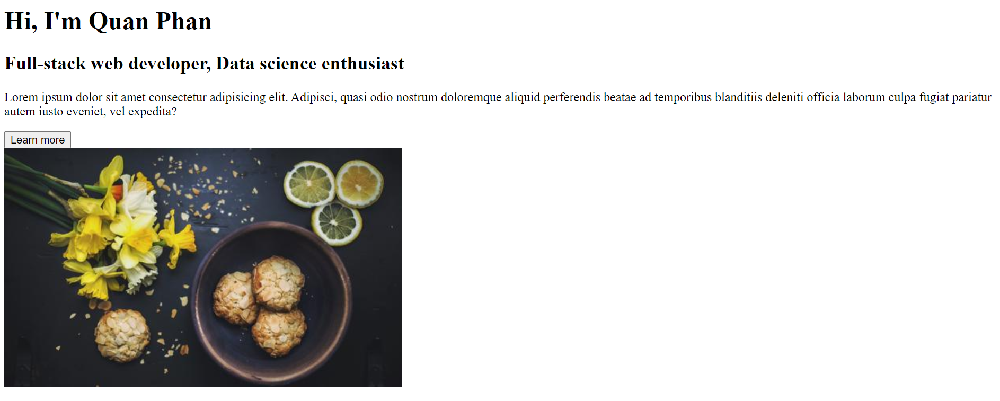
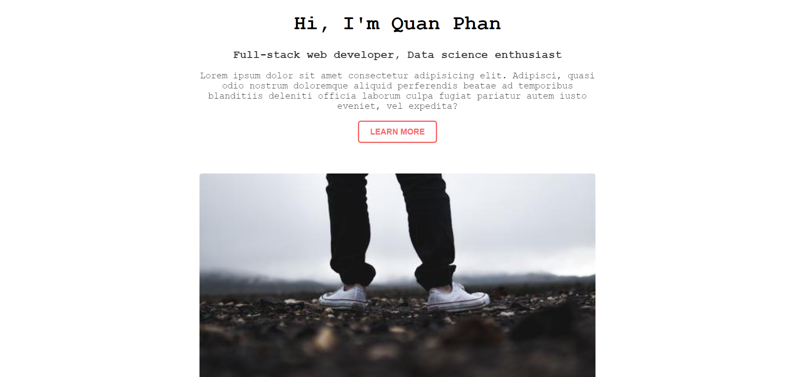

# Basic Web - HTML/CSS

## Thêm CSS cho trang web

### Phân tích trang web

Trước khi bắt tay vào viết CSS, ta cũng cần phải phân tích thiết kế của trang web. Hãy so sánh bản HTML không có CSS và bản có CSS:




Cách yêu cầu đặt ra cho CSS là:

1.  Font chữ không phải là Times New Roman mà là Courier New. Tuy nhiên mọi người có thể dùng font chữ gì tuỳ thích.
2.  Sub-title nhỏ hơn và nhạt hơn title
3.  Paragraph nhỏ hơn và nhạt hơn subtitle
4.  Nút nhấn đã thay đổi style hoàn toàn
5.  4 góc của bức ảnh đã được bo tròn. Giữa nút nhấn và tấm ảnh có một khoảng trống
6.  Nội dung chỉ chiếm 50% độ rộng trang web, và các title, subtitle, paragraph, button, img đều được canh giữa

Ta sẽ lần lượt đi xử lý hết các yêu cầu trên.

### Font chữ

Ta sẽ thay đổi font chữ cho toàn bộ trang HTML. Để áp dụng một CSS declaration nào đấy cho toàn bộ trang HTML, ta sẽ style trên tag `body` (nghĩa là selector của chúng ta sẽ là `body`). Viết dòng sau vào `index.css`:

```css
body {
    font-family: "Courier New";
}
```

Property `font-family` sẽ cho phép ta định dạng font cho element mà ta đã chọn. Nếu giá trị của một style có nhiều hơn một từ giống như trên thì phải đặt trong dấu ngoặc kép.

### Subtitle và paragraph

Ta đã đặt title trong tag `h1`, subtitle nằm trong tag `h2`. Viết tiếp vào `index.css`:

```css
h2 {
    opacity: 80%;
    font-size: 1.1em;
}
```

Để subtitle nhạt hơn, ta dùng property `opacity` (độ đậm / nhạt), và set value của nó là `80%`.

Để subtitle nhỏ hơn title, ta dùng property `font-size` (độ lớn font), và set value của nó là `1.1em` (tại vì thẻ `h1` có mặc định là `font-size: 2em`).

Ta cũng style tương tự cho tag `p`. Viết tiếp vào `index.css`:

```css
p {
    opacity: 85%;
    font-size: 0.9em;
}
```

#### Ghi chú về đơn vị trong CSS

Trong CSS có một số đơn vị (units) để thể hiện độ dài, `px` (đã đề cập ở bài đầu tiên) và `em` hai trong số đó. Các đơn vị này được chia làm hai loại: đơn vị absolute và đơn vị relative.

Đơn vị absolute là loại đơn vị fixed, không thay đổi. `px` là đơn vị absolute. Ngoài ra còn có `cm`, `mm`, `in`, etc.

Đơn vị relative là loại đơn vị sẽ thay đổi tuỳ theo độ dài của một thành phần độ dài nào khác. Trong đó có:

-   `em` sẽ định dạng độ dài một element dựa theo font-size ban đầu của element đấy. (`2em` nghĩa là 2 lần font-size ban đầu của element). Ta xem [demo](https://www.w3schools.com/cssref/tryit.asp?filename=trycss_unit_em) để hiểu rõ hơn.
-   `%` là định dạng độ dài của một element dựa vào độ dài của element cha của nó.

    -   Lưu ý về element cha - con:

        ```html
        <div>
            <p>This is a paragraph</p>
            <button>This is a button</button>
        </div>
        ```

        Element `div` gọi là element cha của element `p` và element `button`, và ngược lại `p` và `button` là các elements con của `div`

    -   Với đoạn HTML nhỏ trên, giả sử ta viết bên file CSS:

        ```css
        p {
            width: 50%;
        }
        ```

        Thì element `p` sẽ có độ rộng bằng 50% element `div` (là element cha của nó)

-   ...

### Nút nhấn (button)

Để thay đổi style của element `button`, viết vào `index.css`:

```css
button {
    background-color: transparent;
    border-radius: 0.375em;
    border: 0;
    box-shadow: inset 0 0 0 2px #f56a6a;
    color: #f56a6a;
    cursor: pointer;
    display: inline-block;
    font-weight: 700;
    line-height: 2.8em;
    padding: 0 1.5em;
    text-transform: uppercase;
    text-decoration: none;
    font-size: 0.8em;
}
```

#### Giải thích code

-   `background-color: transparent` làm cho background button từ xám nhạt mặc định chuyển sang trong suốt
-   `border-radius: 0.375em` dùng để bo tròn 4 góc của button
-   `border: 0` làm cho đường viền của button biến mất
-   `box-shadow: inset 0 0 0 2px #f56a6a` tạo bóng cho button
-   `color: #f56a6a` chỉnh màu cho chữ bên trong button
-   `cursor: pointer` khi ta đưa chuột vào vùng button, chuột sẽ chuyển thành hình bàn tay
-   `display: inline-block`
-   `font-weight: 700` tăng độ đậm cho chữ (có 9 mức từ 100 đến 900)
-   `padding: 0 1.5em` thay đổi khoảng cách giữa chữ bên trong và giới hạn của button
-   `text-transform: uppercase` chuyển chữ bên trong button thành in hoa
-   `text-decoration: none`

### Ảnh

Để thay đổi style của element `img`, viết tiếp vào `index.css`:

```css
img {
    margin-top: 3em;
    border-radius: 4px;
    width: 100%;
}
```

-   Tăng giãn cách giữa button và ảnh (lên thành 3em): `margin-top: 3em`
-   Bo tròn góc ảnh: `border-radius: 4px`
-   Làm cho ảnh rộng bằng độ rộng của element `div`: `width: 100%` (element `div` là cha của element `img`)

### Toàn bộ văn bản

Độ rộng của element `body` đang chiếm trọn độ rộng của màn hình. Vì vậy, muốn phần nội dung của chúng ta chỉ chiếm 50% màn hình, ta viết thêm vào file `index.css`:

```css
div {
    width: 50%;
    text-align: center;
}
```

-   Độ rộng của element `div` chỉ chiếm 50% độ rộng của element `body`: `width: 50%` (element `div` là cha của element `img`)
-   Canh giữa cho tất cả các dòng: `text-align: center`. (Các giá trị khác của `text-align` gồm `left`, `right` và `justify`)

Cuối cùng, để nội dung nằm chính giữa màn hình, ta sẽ dùng kỹ thuật Flexbox trong CSS (Đọc thêm về [Flexbox](https://css-tricks.com/snippets/css/a-guide-to-flexbox/)

Ta viết thêm styles vào khối CSS declaration của element `body`:

```css
body {
    font-family: "Courier New";
    display: flex; /* Phần thêm vào */
    justify-content: center; /* Phần thêm vào */
}
```

[Toàn bộ file CSS](../src/index.css)

Bài trước: [Viết HTML cho trang web](../html_code/html_code.md)
