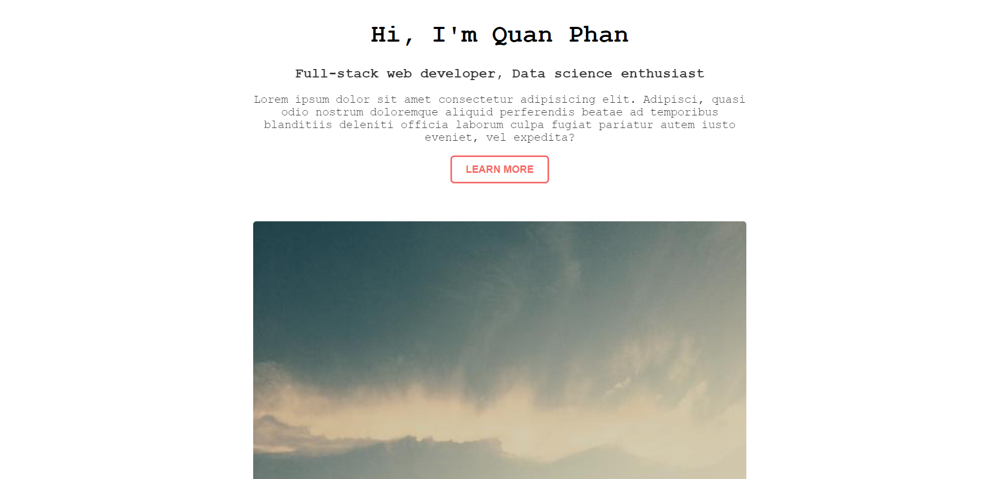
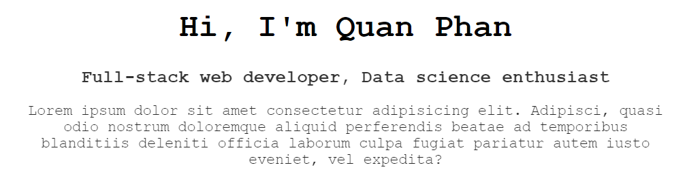

# Basic Web - HTML/CSS

## Viết HTML cho trang web

### Phân tích trang web

Trước khi viết bắt tay vào viết HTML, chúng ta hãy phân tích xem trang web chúng ta muốn thiết kế sẽ có những thành phần gì.



Đoạn văn bao gồm một title lớn, một sub-title nhỏ, và một đoạn văn. Ta sẽ lần lượt sử dụng các tag `h1`, `h2` và `p` cho các thành phần này.



Bên dưới đoạn văn có một nút nhấn (button) và một tấm hình. Ta sẽ lần lượt dùng các tag `button` và `img` cho các thành phần này.


### The code

Viết những dòng sau vào bên trong element `body` (thêm vào sau tag `<body>` và trước tag `</body>`) của file `index.html`:

```html
<div>
    <h1>Hi, I'm Quan Phan</h1>
    <h2>Full-stack web developer, Data science enthusiast</h2>
    <p>
        Lorem ipsum dolor sit amet consectetur adipisicing elit. Adipisci, quasi
        odio nostrum doloremque aliquid perferendis beatae ad temporibus
        blanditiis deleniti officia laborum culpa fugiat pariatur autem iusto
        eveniet, vel expedita?
    </p>
    <button>Learn more</button>
    
</div>
```

Để lấy link ảnh, bạn vào link này: [Lorem picsum](https://picsum.photos/)

Trong đoạn code HTML trên, ta thấy tag `div` là chưa được nhắc đến. Thẻ div dùng để gom nhóm một số elements trên HTML thành một nhóm. Việc gom nhóm sẽ tiện cho việc style bên CSS. Cụ thể mình sẽ đề cập khi qua phần CSS. Vì trang web của chúng ta nhỏ gọn, nên chúng ta chỉ cần gom tất cả phần tử lại thành một nhóm duy nhất.

[Toàn bộ file HTML](../src/index.html)

Bài trước: [Giới thiệu chung về HTML và CSS](../introduction/introduction.md)

Bài tiếp theo: [Thêm CSS cho trang web](../css_code/css_code.md)
