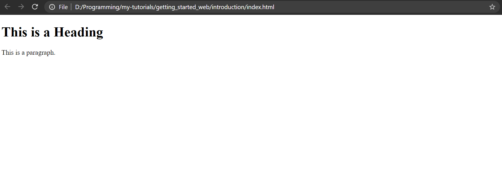
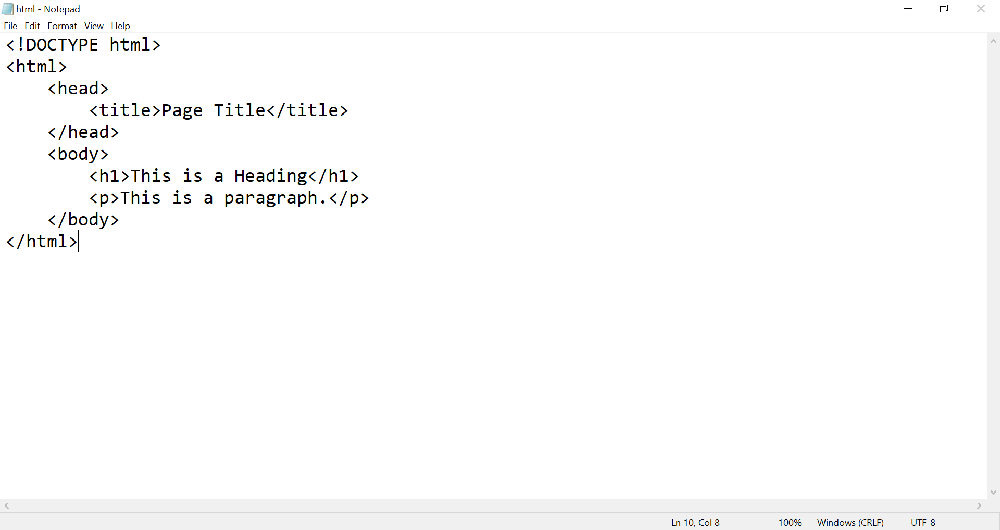
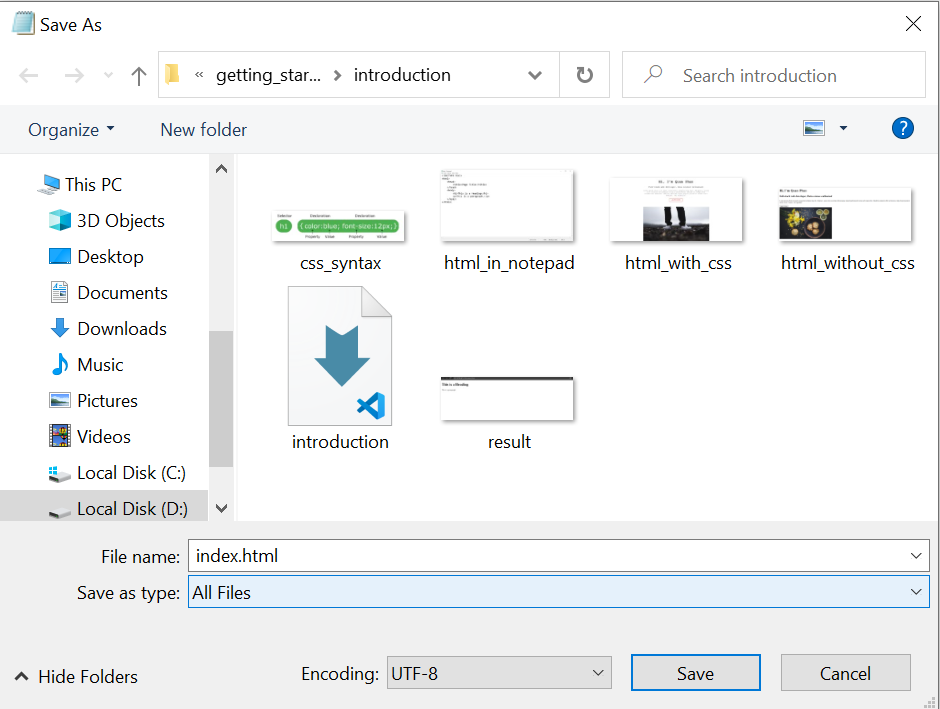
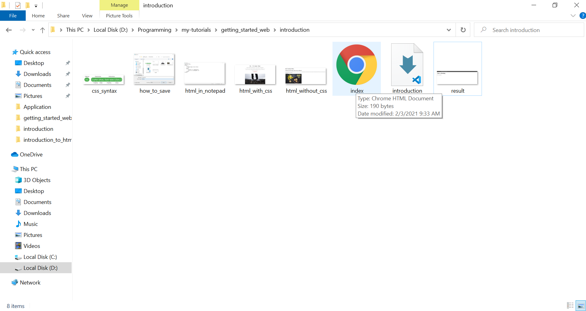
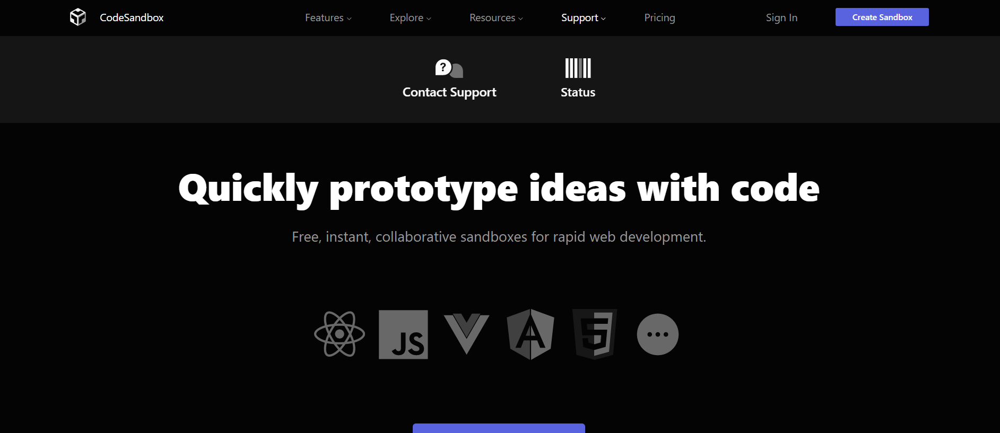
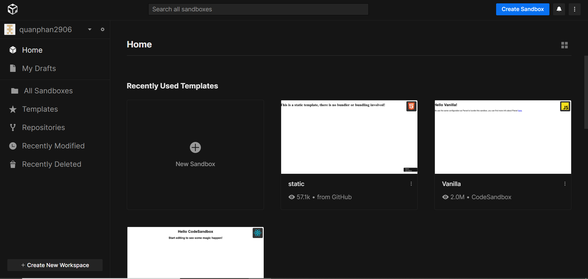
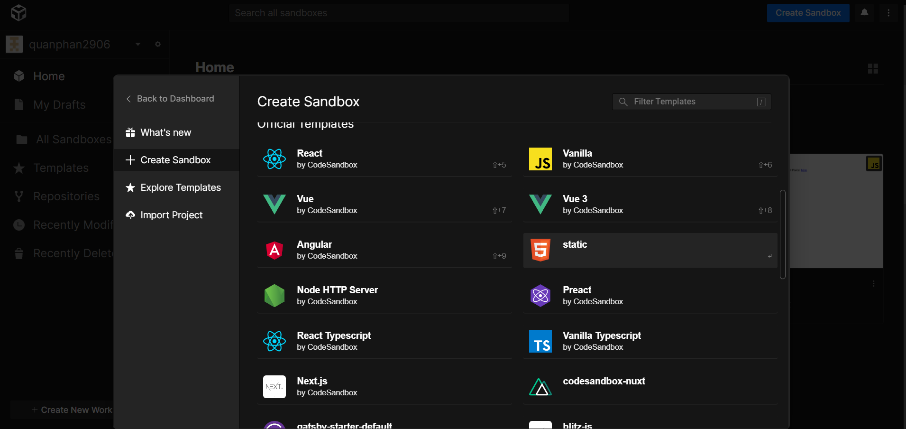
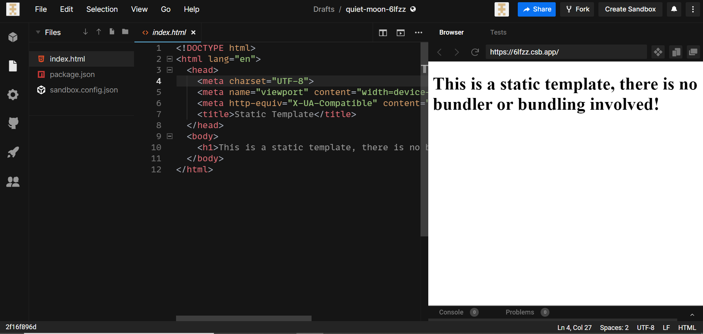
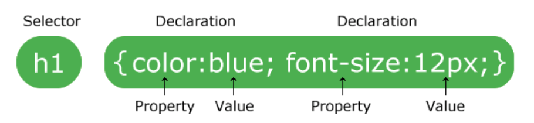

# BASIC WEB DEV - HTML/CSS

## Giới thiệu chung

HTML (Hypertext Markup Language) không phải là ngôn ngữ lập trình, mà chỉ là ngôn ngữ đánh dấu dùng để tạo và cấu trúc các thành phần trong một trang web.

Tuy nhiên HTML chỉ dùng để hình thành "sườn" của trang web. Để thêm màu sắc, định dạng, etc. cho trang web, chúng ta cần dùng thêm CSS (Cascading Style Sheets). CSS sẽ miêu tả cho browser (như Chrome, Edge, Firefox, etc.) cách để trình bày HTML như nào.

Nếu không có CSS mà chỉ dùng HTML, trang web của chúng ta sẽ nhìn như thế này:


Cũng là trang web ấy với một số CSS styles đơn giản:


## HTML

HTML miêu tả cấu trúc của một trang web bằng nhiều `elements`. Các `elements` sẽ cho browser biết đâu là `heading`, đâu là `paragraph`, đâu là `link`.

Một đoạn HTML đơn giản:

```html
<!DOCTYPE html>
<html>
    <head>
        <title>Page Title</title>
    </head>
    <body>
        <h1>This is a Heading</h1>
        <p>This is a paragraph.</p>
    </body>
</html>
```

Đây là kết quả của đoạn code trên:



#### Giải thích ví dụ trên

-   `Element` `<!DOCTYPE html>` nói cho browser biết đây là một file HTML5. Bất cứ file HTML nào cũng cần phải bắt đầu bằng dòng này.
-   `Element` `<html>` là `element` gốc của một trang HTML. Nó đánh dấu sự bắt đầu của một văn bản HTML.
-   `Element` `<head>` chứa một số thông tin về file HTML5. Những gì được viết trong `<head>` sẽ không được browser vẽ lên màn hình web.
-   `Element` `<title>` đánh dấu phần chữ bên trong nó là tên của trang web.
-   `Element` `<body>` chứa phần thân của trang HTML. Những gì được viết trong `<body>` sẽ browser vẽ lên màn hình web.
-   `Element` `<h1>` đánh dấu phần chữ bên trong nó là `heading` lớn nhất. (Trong html có 6 kích cỡ `heading`, được đánh dấu từ `h1` là lớn nhất đến `h6` là nhỏ nhất. Sẽ đề cập sâu hơn sau.)
-   `Element` `<p>` đánh dấu phần chữ bên trong nó là một `paragraph`.

### Vậy HTML Element là gì?

Một HTML element bao gồm tag mở đầu, nội dung bên trong, và tag kết thúc. Một HTML element thường sẽ có syntax như sau:

`<[tên tag]> [Nội dung] </[tên tag]>`

Ví dụ như:

-   `<h1> First heading </h1> `
-   `<p> Paragraph </p> `

Lưu ý:

-   Cần phân biệt tag với element. Element bao gồm tag lẫn nội dung bên trong.
-   Một số HTML element không có nội dung bên trong cũng không có tag kết thúc (ví dụ tag `<br>`)
-   Nội dung bên trong của một HTML Element có thể là một HTML element khác. Chẳng hạn, nội dung của tag `<head>` có element `<title>Page Title</title>`.

### HTML attributes

### Viết HTML ở đâu và "chạy" file HTML như thế nào?

Có nhiều phần mềm ta có thể dùng để viết và "chạy" HTML.

#### Notepad

Mở notepad lên. Sao chép và dán đoạn code html ban đầu vào như sau.



Lưu lại (Ctrl + S) với tên tuỳ ý (trong tutorial này mình sẽ dùng tên `index.html`), nhưng phải đúng định dạng đuôi .html như sau:



Vào nơi lưu file html. Nhấp đúp vào file html:



Ta sẽ thấy được kết quả như ban đầu:


#### Các text editors khác

Có nhiều text editors offline và online khác như Visual Studio Code, Atom, Sublime Text, Codepen etc. Trong tutorial này chúng ta sẽ dùng [CodeSandbox](https://codesandbox.io/).

Giao diện trang web như sau:



Chọn Sign in -> Sign in with Google. Dùng tài khoản của Google của bạn để sign in.

Sign in xong bạn sẽ vào trang chủ như sau:



Chọn New Sandbox. Kéo chuột xuống chọn Static:



Ta sẽ được dẫn tới trang bên dưới:



Codesandbox đã viết sẵn cho chúng ta một starter template. Chúng ta sẽ dùng template này chứ không code lại từ đầu như trên Notepad nữa. Trong template này chúng ta vẫn thấy các elements quen thuộc đã được nhắc đến như, `<!DOCTYPE html>`, `<head>`, `<title>`, `<body>`, `<h1>`. Có một số elements mới như `<meta>`, nhưng tạm thời ta chưa cần quan tâm.

## CSS

CSS được dùng để cấu hình giao diện cho trang web. Cùng một sườn HTML, với những CSS styles khác nhau, ta sẽ được các giao diện với màu sắc, thiết kế, layout, etc. khác nhau. Cùng nhấp vào [đây](https://www.w3schools.com/css/css_intro.asp) để xem demo!

Một đoạn CSS đơn giản:

```css
h1 {
    color: black;
    font-size: 14px;
}

p {
    opacity: 85%;
}
```

### CSS format

Mỗi khai báo CSS có một selector và một khối declaration:


Nguồn: [w3schools.com](https://www.w3schools.com/css/css_syntax.asp)

-   Mỗi khai báo CSS có một hoặc nhiều declaration, mỗi declaration tách nhau bằng dấu chấm phẩy
-   Mỗi declaration có property và value, cách nhau bởi dấu hai chấm
-   Mỗi khối declaration được bọc bởi cặp dấu ngoặc nhọn

Trong ví dụ ban đầu:

-   `h1` và `p` là selectors
-   `color: black`, `font-size: 14px` và `opacity: 85%` là các declarations. Trong đó:

    -   `color`, `font-size`, `opacity` là property
    -   `black`, `14px`, `85%` là values
