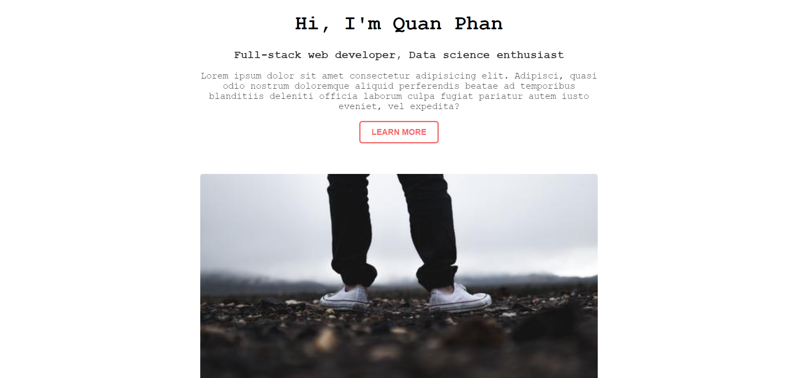

# BASIC WEB DEV - HTML/CSS

## Giới thiệu chung

HTML (Hypertext Markup Language) không phải là ngôn ngữ lập trình, mà chỉ là ngôn ngữ đánh dấu dùng để tạo và cấu trúc các thành phần trong một trang web.

Tuy nhiên HTML chỉ dùng để hình thành "sườn" của trang web. Để thêm màu sắc, định dạng, etc. cho trang web, chúng ta cần dùng thêm CSS (Cascading Styling Sheet). CSS sẽ miêu tả cho browser (Chrome, Edge, Firefox, etc.) cách để trình bày HTML như nào.

Nếu không có CSS, trang web của chúng ta sẽ nhìn như thế này:

Còn đây là trang web ấy với một số CSS đơn giản:

