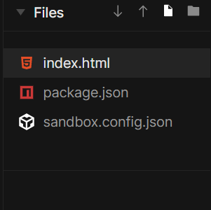

# BASIC WEB DEV - HTML/CSS

## Giới thiệu chung

HTML (Hypertext Markup Language) không phải là ngôn ngữ lập trình, mà chỉ là ngôn ngữ đánh dấu dùng để tạo và cấu trúc các thành phần trong một trang web.

Tuy nhiên HTML chỉ dùng để hình thành "sườn" của trang web. Để thêm màu sắc, định dạng, etc. cho trang web, chúng ta cần dùng thêm CSS (Cascading Style Sheets). CSS sẽ miêu tả cho browser (như Chrome, Edge, Firefox, etc.) cách để trình bày HTML như nào.

Nếu không có CSS mà chỉ dùng HTML, trang web của chúng ta sẽ nhìn như thế này:


Cũng là trang web ấy với một số CSS styles đơn giản:


## HTML

HTML miêu tả cấu trúc của một trang web bằng nhiều `elements`. Các `elements` sẽ cho browser biết đâu là `heading`, đâu là `paragraph`, đâu là `link`.

Một đoạn HTML đơn giản:

```html
<!DOCTYPE html>
<html>
    <head>
        <title>Page Title</title>
    </head>
    <body>
        <h1>This is a Heading</h1>
        <p>This is a paragraph.</p>
    </body>
</html>
```

Đây là kết quả của đoạn code trên:


#### Giải thích ví dụ trên

-   `Element` `<!DOCTYPE html>` nói cho browser biết đây là một file HTML5. Bất cứ file HTML nào cũng cần phải bắt đầu bằng dòng này.
-   `Element` `<html>` là `element` gốc của một trang HTML. Nó đánh dấu sự bắt đầu của một văn bản HTML.
-   `Element` `<head>` chứa một số thông tin về file HTML5. Những gì được viết trong `<head>` sẽ không được browser vẽ lên màn hình web.
-   `Element` `<title>` đánh dấu phần chữ bên trong nó là tên của trang web.
-   `Element` `<body>` chứa phần thân của trang HTML. Những gì được viết trong `<body>` sẽ browser vẽ lên màn hình web.
-   `Element` `<h1>` đánh dấu phần chữ bên trong nó là `heading` lớn nhất. (Trong html có 6 kích cỡ `heading`, được đánh dấu từ `h1` là lớn nhất đến `h6` là nhỏ nhất. Sẽ đề cập sâu hơn sau.)
-   `Element` `<p>` đánh dấu phần chữ bên trong nó là một `paragraph`.

### Viết HTML ở đâu và "chạy" file HTML như thế nào?

Ta sẽ viết HTML vào một text editor bất kỳ, lưu lại với định dạng đuôi .html, sau đó nhấp đúp file đó để mở lên bằng một browser bất kỳ. Một trong những text editor ta có thể dùng là Notepad.

#### Notepad

Mở notepad lên. Sao chép và dán đoạn code html ban đầu vào như sau.


Lưu lại (Ctrl + S) với tên tuỳ ý (trong tutorial này mình sẽ dùng tên `index.html`), nhưng phải đúng định dạng đuôi .html như sau:


Vào nơi lưu file html. Nhấp đúp vào file html:


Ta sẽ thấy được kết quả như ban đầu:


Nếu như ta muốn mở file bằng Notepad để chỉnh sửa code HTML, ta có hai cách:

1. Nhấp chuột phải vào file. Chọn Open with Notepad
2. Mở Notepad lên. Vào File, Open. Chọn file index.html để mở

#### Các text editors khác

Có nhiều text editors offline và online khác mà ta có thể dùng để viết HTML như Visual Studio Code, Atom, Sublime Text, Codepen etc. Đối với các offline editors thì cách "chạy" file HTML cũng tương tự như với Notepad. Tuy nhiên, trong tutorial này chúng ta sẽ dùng một online editor là [CodeSandbox](https://codesandbox.io/).

Giao diện trang web như sau:


Chọn Sign in -> Sign in with Google. Dùng tài khoản của Google của bạn để sign in.

Sign in xong bạn sẽ vào trang chủ như sau:


Chọn New Sandbox. Kéo chuột xuống chọn Static:


Ta sẽ được dẫn tới trang bên dưới:


Trang này bao gồm 3 vùng chính: vùng chứa danh sách các files, vùng chứa code, và vùng preview kết quả.

Codesandbox đã viết sẵn cho chúng ta một starter template ở vùng chứa code. Để tạo ra sản phẩm cuối cùng trong tutorial này, chúng ta sẽ viết thêm HTML vào starter template này trong những bài sau.

Bây giờ chúng ta hãy đi tìm hiểu về những khái niệm quan trọng trong HTML.

### Vậy HTML Element là gì?

Một HTML element bao gồm tag mở đầu, nội dung bên trong, và tag kết thúc. Một HTML element thường sẽ có syntax như sau:

`<[tên tag]> [Nội dung] </[tên tag]>`

Ví dụ như:

-   `<h1> First heading </h1> `
-   `<p> Paragraph </p> `

Lưu ý:

-   Cần phân biệt tag với element. Element bao gồm tag lẫn nội dung bên trong.
-   Một số HTML element không có nội dung bên trong cũng không có tag kết thúc (ví dụ tag `<br>`)
-   Nội dung bên trong của một HTML Element có thể là một HTML element khác. Chẳng hạn, nội dung của tag `<head>` có element `<title>Page Title</title>`.

Trong HTML có nhiều loại tag khác nhau. Mỗi tag đánh dấu một loại văn bản nhất định. Ví dụ như các tag `h1` đến `h6` đánh dấu các headings, `p` đánh dấu paragraph, `img` đánh dấu hình ảnh, `video` đánh dấu video, etc.

### HTML attributes

Mọi HTML elements đều có thể có attributes. HTML attributes được viết ở tag mở đầu của element, cung cấp cho browser thêm thông tin về element ấy.

Một element có thể có một hoặc nhiều attributes. Các attributes thường xuất hiện dưới dạng: `[name]=[value]`.

Ví dụ chúng ta có thể các attributes `src`, `width`, `height` cho tag `img` như sau:

```html

```

Trong đó

-   Attribute `src` có giá trị là URL của ảnh. URL này có thể là absolute URL (giống như ở trong ví dụ) hoặc relative URL. Trong phạm vi tutorial này, chúng ta chỉ quan tâm absolute URL. Absolute URL là URL của một bức ảnh được host trên một website khác.
-   Attribute `width` có giá trị là độ rộng của bức ảnh được tính theo đơn vị pixel (px).
-   Attribute `height` có giá trị là chiều cao của bức ảnh được tính theo đơn vị pixel (px).
-   Attribute `alt` có giá trị là một dòng text. Dòng text này sẽ xuất hiện nếu không may, vì một lý do gì đấy, ảnh không load lên được.

Đối với một element, có những attributes là bắt buộc phải có, có những attributes không nhất thiết phải có. Ví dụ như với tag `img`, attribute `src` bắt buộc phải có, `width`, `height` và `alt` là không bắt buộc. Hoặc như với tag `html`, attribute `lang` không bắt buộc phải xuất hiện. Nó chỉ có tác dụng nói cho browser biết ngôn ngữ chính của trang web là gì (ở đây là `en` - English).

Để biết một element có những attributes nào, những attributes nào là bắt buộc, những attributes nào không, chúng ta có thể hỏi Google!

## CSS

CSS được dùng để cấu hình giao diện cho trang web. Cùng một sườn HTML, với những CSS styles khác nhau, ta sẽ được các giao diện với màu sắc, thiết kế, layout, etc. khác nhau. Cùng nhấp vào [đây](https://www.w3schools.com/css/css_intro.asp) để xem demo!

Một đoạn CSS đơn giản:

```css
h1 {
    color: black;
    font-size: 14px;
}

p {
    opacity: 85%;
}
```

Nếu như ta "nhúng" file CSS này vào trang HTML (cách "nhúng" sẽ được đề cập sau) thì toàn bộ elements `h1` sẽ có màu (`color`) đen, có font chữ (`font-size`) 14 px, toàn bộ elements p sẽ có độ đậm (`opacity`) bằng 85% độ đậm mặc định.

### CSS format

Mỗi khai báo CSS có một selector và một khối declaration:


Nguồn: [w3schools.com](https://www.w3schools.com/css/css_syntax.asp)

-   Mỗi khai báo CSS có một hoặc nhiều declaration, mỗi declaration tách nhau bằng dấu chấm phẩy. Mỗi declaration nên nằm trên một dòng riêng biệt để dễ đọc (mặc dù không bắt buộc).
-   Mỗi declaration có property và value, cách nhau bởi dấu hai chấm
-   Mỗi khối declaration được bọc bởi cặp dấu ngoặc nhọn

Trong ví dụ ban đầu:

-   `h1` và `p` là selectors. Selector sẽ báo cho browser biết là những CSS declarations chứa trong cặp dấu ngoặc nhọn ngay sau nó sẽ được áp dụng cho những elements nào.
-   `color: black`, `font-size: 14px` và `opacity: 85%` là các declarations. Trong đó:

    -   `color`, `font-size`, `opacity` là các propertíes
    -   `black`, `14px`, `85%` là các values

### "Nhúng" file CSS vào HTML như thế nào?

Đầu tiên ta sẽ tạo file CSS trên Codesandbox. Nhấp vào biểu tượng New File:



Đặt tên tuỳ ý. Trong tutorial này mình sẽ đặt là `index.css`. Ta sẽ định dạng cho mọi element `h1` đều sẽ có chữ màu đỏ và font chữ 20px. Để làm được như vậy, hãy viết những dòng sau vào `index.css`:

```css
h1 {
    color: red;
    font-size: 20px;
}
```

Qua file `index.html`, viết dòng code sau vào ngay dưới element `title`:

```html
<link rel="stylesheet" type="text/css" href="index.css" />
```

Như vậy là bạn đã kết nối được file CSS với file HTML rồi đấy. Toàn bộ styles trong CSS sẽ được áp dụng cho trang HTML. Cùng xem giao diện của chúng ta lúc này nào:


Tag `link` dùng để "nhúng" CSS vào HTML. Tag `link` có những attributes sau cần quan tâm:

-   `rel` (bắt buộc):
