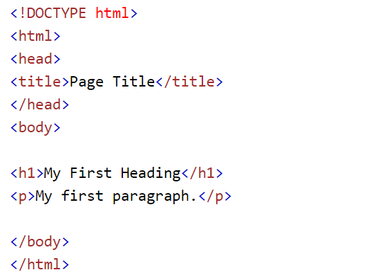

# BASIC WEB DEV - HTML/CSS

## Giới thiệu về HTML

HTML miêu tả cấu trúc của một trang web bằng nhiều `elements`. Các `elements` sẽ cho browser biết đâu là `heading`, đâu là `paragraph`, đâu là `link`.

Một đoạn HTML đơn giản từ [w3schools](https://www.w3schools.com/html/html_intro.asp):

### Giải thích ví dụ trên

-   `Element` `<!DOCTYPE html>` nói cho browser biết đây là một file HTML5.
-   `Element` `<html>` là `element` gốc của một trang HTML.
-   `Element` `<head>` chứa một số thông tin về file HTML5.
-   `Element` `<title>` đánh dấu phần chữ bên trong nó là tên của trang web.
-   `Element` `<body>` chứa phần thân của trang HTML. Những gì được viết trong `<body>` sẽ browser vẽ lên màn hình.
-   `Element` `<h1>` đánh dấu phần chữ bên trong nó là `heading` lớn nhất.
-   `Element` `
` đánh dấu phần chữ bên trong nó là một `paragraph`.

## Vậy HTML Element là gì?

Một HTML element bao gồm tag mở đầu, nội dung bên trong, và tag kết thúc. Một HTML element thường sẽ có syntax như sau:

`<[tên thẻ]> [Nội dung] </[tên thẻ]>`

Ví dụ như:

-   `<h1> First heading </h1> `
-   `
 Paragraph 
 `

Lưu ý:

-   Cần phân biệt tag với element. Element bao gồm tag lẫn nội dung bên trong.
-   Một số HTML element không có nội dung bên trong cũng không có tag kết thúc (ví dụ tag ` `)
